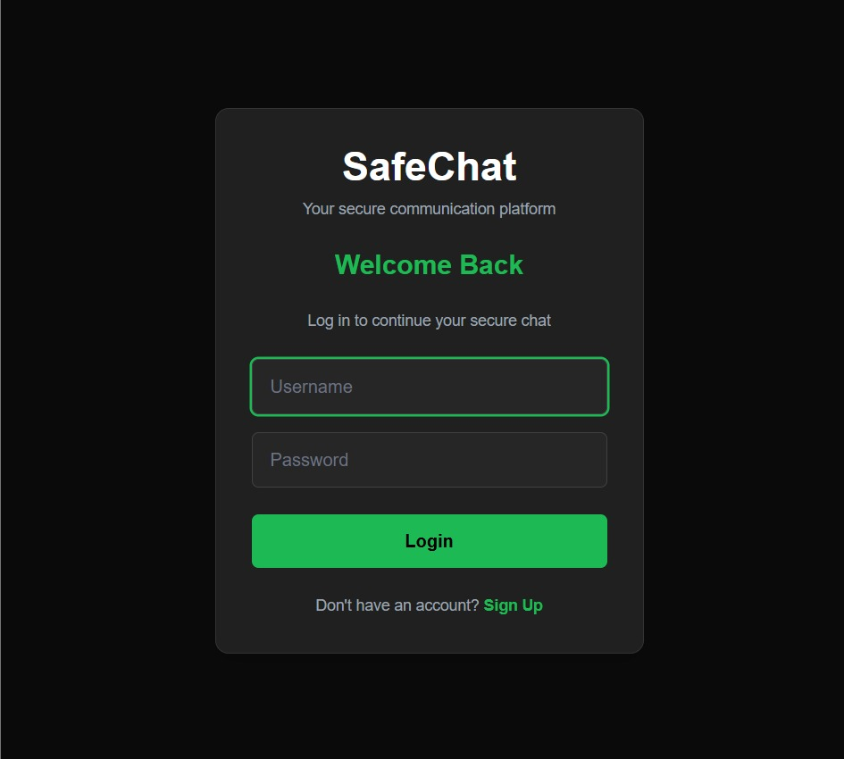
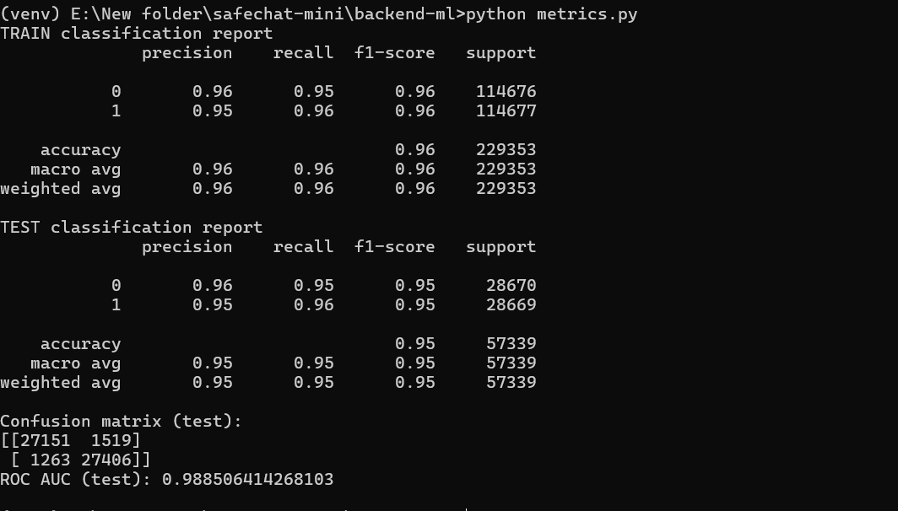
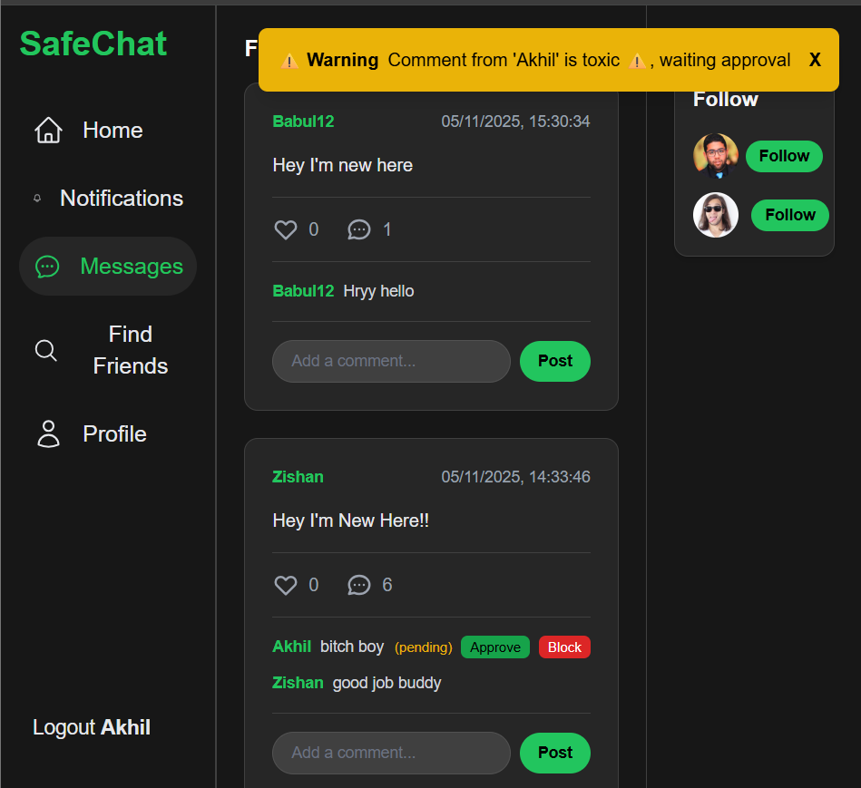
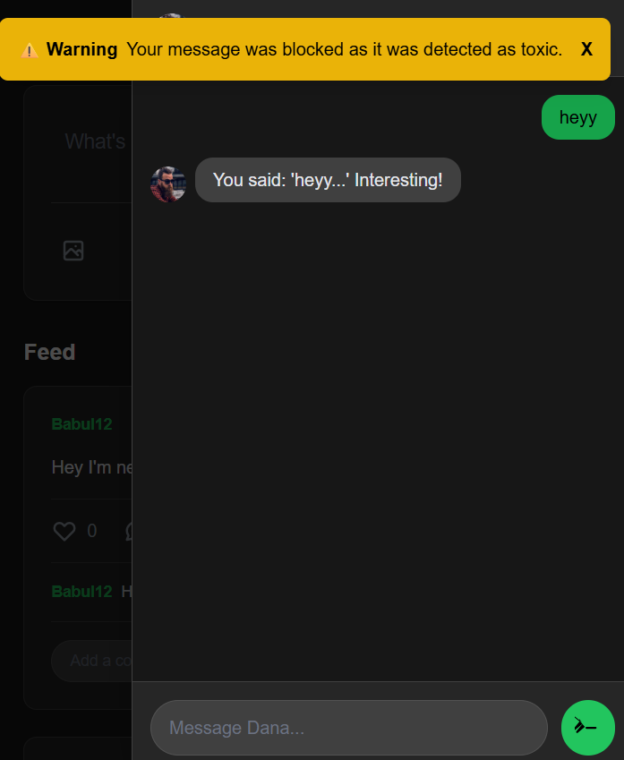

**SafeChat — AI-Powered Real-time Cyberbullying Detection System**

SafeChat is a full-stack demo that showcases a small social/chat app protected by an ML-based toxicity detector. The backend (FastAPI + scikit-learn) classifies text and enforces moderation rules (block toxic private messages, mark posts/comments for review). The frontend is a React + Vite UI demonstrating the user flows.

**What you get**
- **Toxicity detection:** A trained TF‑IDF + Logistic Regression model to detect toxic text.
- **Moderation rules:** Private chat blocks toxic messages; posts/comments can be marked pending.
- **Full-stack example:** FastAPI backend, MySQL storage, React frontend (Vite + Tailwind).

**Tech Stack**
- **Backend:** `Python`, `FastAPI`, `uvicorn`, `scikit-learn`, `joblib`, `pandas`, `mysql-connector-python`, `bcrypt`.
- **Frontend:** `React` + `Vite`, `Tailwind CSS`, `@heroicons/react`.

**Repository layout (important files)**
- **`backend-ml/`**: FastAPI server and ML code (`app.py`, `train_model.py`, `evaluate.py`, `database.py`).
- **`backend-ml/models/`**: trained artifacts (`vectorizer.joblib`, `model.joblib`).
- **`safechat-react/`**: React frontend powered by Vite (`package.json`, `src/`).

**Quick Start (Windows — PowerShell)**

Prerequisites:
- Install Python 3.9+ and Node.js (16+ recommended).
- MySQL server running locally (or update `backend-ml/database.py` to point to your DB).

1) Backend — create a virtual environment, install dependencies and run

```powershell
cd backend-ml
python -m venv venv
venv\Scripts\Activate.ps1
# If you use cmd.exe: venv\Scripts\activate.bat

# Install required python packages (if you have a `requirements.txt` use it):
pip install fastapi uvicorn scikit-learn joblib pandas mysql-connector-python bcrypt python-multipart

# Start the API server (development):
uvicorn app:app --reload --host 127.0.0.1 --port 8000
```

The API is available at `http://127.0.0.1:8000` by default.

2) Frontend — install deps and run

```powershell
cd safechat-react
npm install
npm run dev
```

The frontend dev server runs at `http://localhost:5173` (Vite default).

3) Database setup
- The project uses MySQL. The default connection in `backend-ml/database.py` points to:
  - `host='localhost'`
  - `user='root'`
  - `password=' '` (a placeholder — replace with your actual password)
  - `database='safechat_db'`

- Create the database and user before first run (example using MySQL shell):

```sql
CREATE DATABASE safechat_db;
-- CREATE USER 'safechat'@'localhost' IDENTIFIED BY 'your_password';
-- GRANT ALL PRIVILEGES ON safechat_db.* TO 'safechat'@'localhost';
```

- Edit `backend-ml/database.py` to set your DB credentials (or modify it to read from environment variables).

4) Model training
- If you want to re-train the classifier (the repo includes `data/train.csv`):

```powershell
cd backend-ml
venv\Scripts\Activate.ps1
python train_model.py
```

- Trained artifacts are written to `backend-ml/models/vectorizer.joblib` and `backend-ml/models/model.joblib`.

5) Notes about moderation behavior (summary of `app.py`)
- **Private chat (`/send_message`)**: messages classified as `toxic` are blocked (not stored) and the user receives a notification. Clean messages are saved and an optional bot reply may be inserted.
- **Posts/Comments (`/create_post`)**: toxic content is marked as `pending` for moderation; non-toxic posts are saved as `approved`.

**Useful API endpoints** (implementations in `backend-ml/app.py`)
- `POST /signup` — Create user (fields: `username`, `email`, `password`).
- `POST /login` — Login (returns username on success).
- `POST /send_message` — Send chat message (body: `user`, `text`, `receiver_username`).
- `GET /get_feed/{username}` — Fetch recent chat history for a user and the bot.
- `POST /create_post` — Create post/comment (fields: `user`, `text`, optional `parent_id`).
- `GET /get_posts` — Get posts with nested comments.
- `POST /upload_image/{username}` — Uploads profile images (multipart file upload).

**Development tips**
- If you add or change DB credentials, re-run the backend and the app will create necessary tables automatically (see `create_tables()` in `app.py`).
- If the model files (`models/vectorizer.joblib`, `models/model.joblib`) are missing the server will continue to run but treat all text as `clean` (see `ensure_model_loaded()` in `app.py`).
- For production, move DB credentials to environment variables and remove plaintext passwords from `database.py`.

**Project Structure (short)**
- `backend-ml/` — API & ML code (`app.py`, `database.py`, `train_model.py`, `models/`).
- `safechat-react/` — Frontend (`src/`, `package.json`).

**Contributing**
- Fixes and improvements welcome. Please open issues for bugs or feature requests.
- Fixes and improvements welcome. Please open issues for bugs or feature requests.

**Screenshots**

Below are screenshots from the project (images are stored in `backend-ml/uploads/`).

- **Login page** (first image)

  

- **Test results / metrics** (second image)

  

- **Home view — feed / pending moderation** (third image)

  

- **Home view — moderation banners / post pending** (fourth image)

  

- **Chat view** (fifth image)

  


